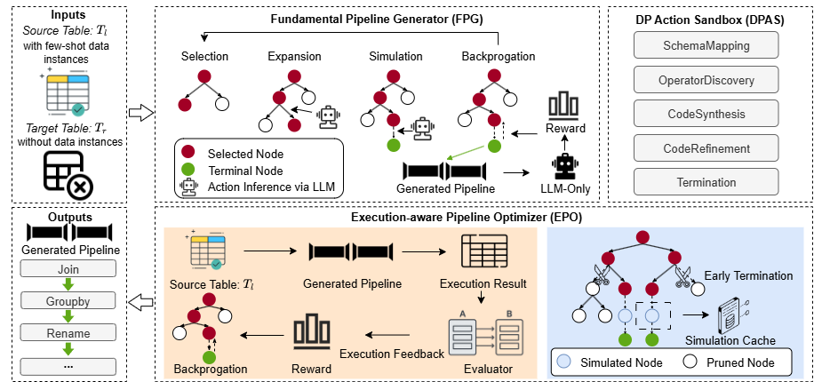

# MontePrep: Monte-Carlo-Driven Automatic Data Preparation without Target Data Instances

> **Note:** This work is currently under review.

This repository is the official implementation of "**MontePrep: Monte-Carlo-Driven Automatic Data Preparation without Target Data Instances**"

In commercial systems, a pervasive requirement for automatic data preparation (ADP) is to transfer relational data from disparate sources to targets with standardized schema specifications. Previous methods rely on labor-intensive supervision signals or target table data access permissions, limiting their usage in real-world scenarios. To tackle these challenges, we propose an effective end-to-end ADP framework MontePrep, which enables training-free pipeline synthesis with zero target-instance requirements. MontePrep is formulated as an open-source large language model (LLM) powered tree-structured search problem. It consists of three pivot components: a data preparation action sandbox (DPAS), a fundamental pipeline generator (FPG), and an execution-aware pipeline optimizer (EPO). We first introduce DPAS, a lightweight action sandbox that navigates the search-based pipeline generation and circumvents exploration of infeasible pipelines. Then, we present FPG to incrementally build executable data preparation pipelines by exploring the predefined action sandbox using LLM-powered Monte Carlo Tree Search. Furthermore, EPO evaluates the reliability of the generated pipelines in FPG by invoking pipeline execution results from sources to targets. In this way, unreasonable pipelines are eliminated, improving both the efficiency and effectiveness of the search process. Extensive experimental results demonstrate the superiority of MontePrep, showing significant improvements over five state-of-the-art competitors.

---

## Framework Architecture

The overall architecture of the framework is illustrated below:



---

## Overview

### Key Experimental Results

| **Method**       | **LLM Model**      | **Auto-Pipeline Dataset** |            |            | **Smart Buildings Dataset** |            |            |
| :--------------- | :----------------- | :-----------------------: | :--------: | :--------: | :-------------------------: | :--------: | :--------: |
|                  |                    | EX (%)                    | CS (%)     | Time (min) | EX (%)                      | CS (%)     | Time (min) |
| SQLMorpher       | Qwen2\.5-Coder-32B | 71\.46                    | 75\.22     | 0\.50      | 55\.45                      | 58\.54     | 0\.42      |
| Chain-of-Tables  | Qwen2\.5-Coder-32B | 56\.13                    | 58\.77     | 0\.12      | 43\.81                      | 48\.03     | **0\.16**  |
| Chain-of-Thought | Qwen2\.5-Coder-32B | 77\.03                    | 79\.97     | **0\.09**  | 51\.43                      | 56\.55     | 0\.20      |
| ReAct            | Qwen2\.5-Coder-32B | 79\.83                    | 84\.40     | 0\.10      | 51\.43                      | 60\.47     | 0\.22      |
| FunctionCalling  | Qwen2\.5-Coder-32B | 18\.27                    | 50\.29     | 0\.28      | 19\.61                      | 30\.08     | 0\.40      |
| MontePrep         | Qwen2\.5-Coder-32B | **88\.57**                | **89\.69** | 1\.16      | **68\.57**                  | **84\.67** | 3\.24      |
| MontePrep           | Qwen2\.5-Coder-14B | 82\.95                    | 85\.74     | 1\.20      | 48\.57                      | 60\.84     | 3\.17      |
| MontePrep           | Qwen2\.5-Coder-7B  | 47\.19                    | 49\.80     | 1\.47      | 17\.14                      | 35\.19     | 4\.34      |

---

## Dataset Description

- **Auto‑Pipeline Dataset**: This benchmark was introduced by Auto-Pipeline (2021) [1].  
  It comprises multi-step pipeline synthesis, with 700 transformation tasks mined from GitHub and industrial sources. Each task includes a target schema specified in a `by-target` format, along with up to 10 transformation steps. To align the dataset with our problem statement, we performed several pre-processing steps. First, we remove duplicate pipelines and all data instances from target tables. Second, since this dataset primarily focused on data instances rather than schema clarity, several target schemas were represented with anonymous values (e.g., `col1`). To address this, we standardize target schemas by assigning meaningful column names. This normalization is common in the deployment of commercial systems, such as master data management.

- **Smart Building Dataset**: This dataset is originally released in SQLMorpher (2023) [2], aiming to build DP pipelines for energy data. It comprises 105 real-world tasks involving complex structural transformations (such as aggregation, pivot, and attribute flattening). The target table in this dataset contains columns that are not related to the source table. This better reflects real-world scenarios, where target schemas often include extraneous or system-specific fields beyond the scope of available data. Besides, the original benchmark includes detailed schema change hints—explicit natural language descriptions of how the target schema differs from the source tables, which serve as strong guidance for pipeline generation. However, such hints are typically unavailable in real-world scenarios. Thus, we remove these hints in our evaluation and rely solely on the source table and target schema to guide the pipeline generation synthesis.


---


[1] Auto-Pipeline: Synthesizing Complex Data Pipelines By-Target Using Reinforcement Learning and Search

[2] Automatic Data Transformation Using Large Language Model
– An Experimental Study on Building Energy Data

## Requirements

To install requirements:

```setup
pip install -r requirements.txt
```

## Quickstart

To quickly set up and run the benchmark, follow the steps below:

### API-Key

Replace the api-key in the following config.py.

```bash
MontePrep/src/llm/config.py
```

### Dataset Preparation

If you need to run the complete experiment, you can download the data from the following link of Google Drive and unzip it to the data folder. For ease of running, we also provide a simple example in the data folder.

- Dataset link: [Google Drive](https://drive.google.com/file/d/1mkFwOzdKuDVA4Y9fdX08KgRpZVVkJZXk/view?usp=sharing)  
- Original dataset link: [Auto-Pipeline Dataset](https://gitlab.com/jwjwyoung/autopipeline-benchmarks) | [Smart Building Dataset](https://github.com/asu-cactus/Data_Transformation_Benchmark)

**Before running any scripts, please set the `PYTHONPATH` to the project root directory:**

```bash
export PYTHONPATH=$(pwd)
```

The following commands can be used to run our model:


```bash
 bash scripts/run_mcts.sh
```
The following command can be used for experimental verification

```bash
 bash scripts/eval_mcts.sh
```


## License

This project is licensed under the MIT License - see the [LICENSE](LICENSE) file for details.

---